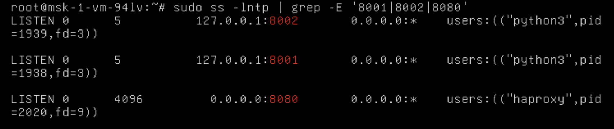
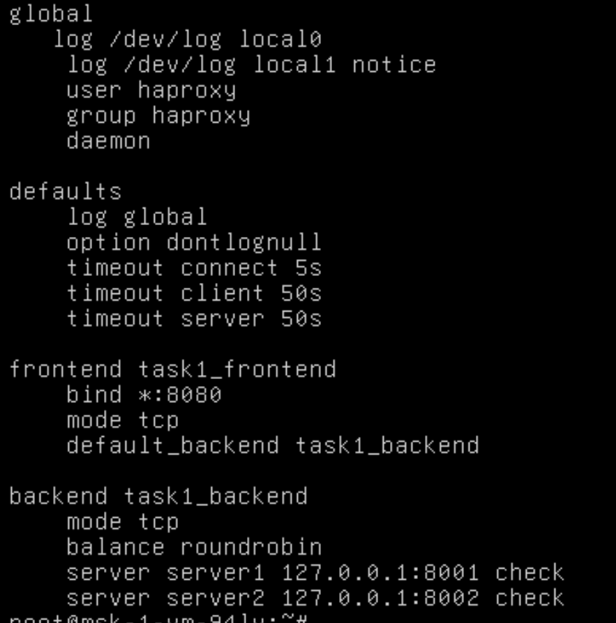
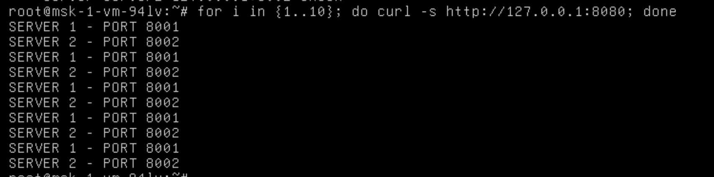
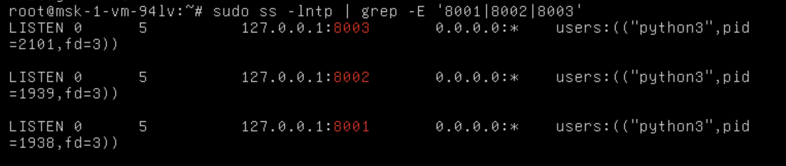
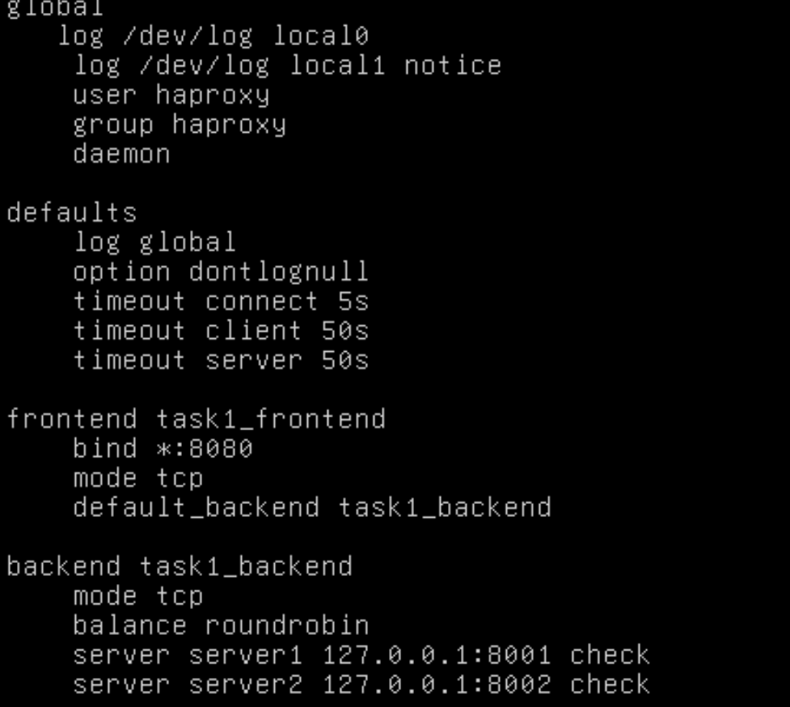
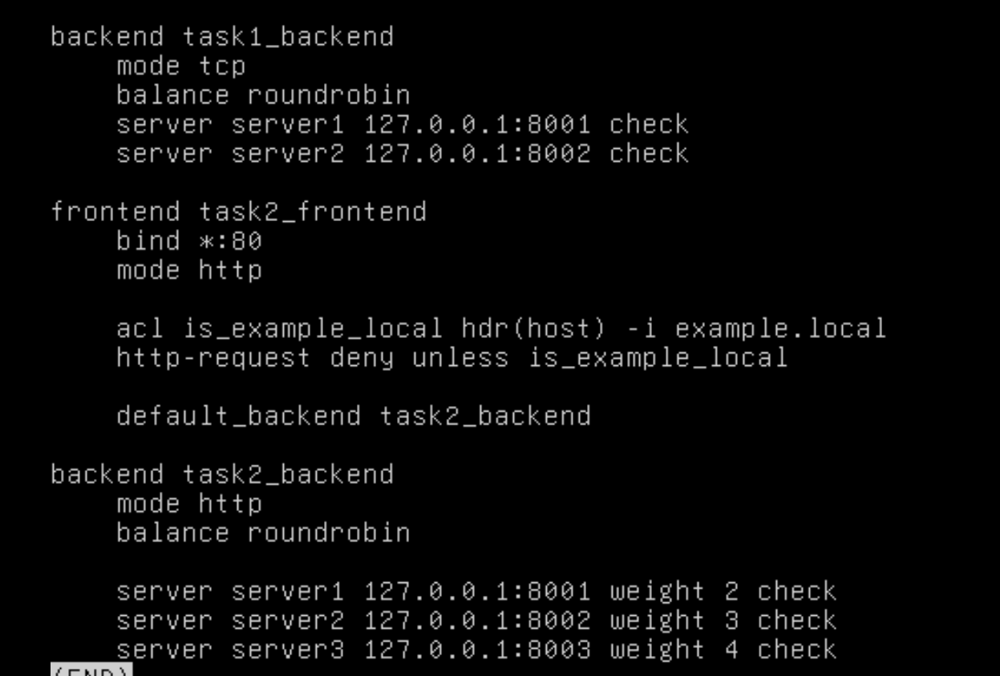
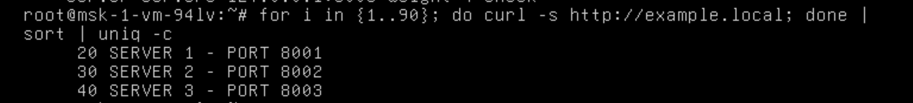
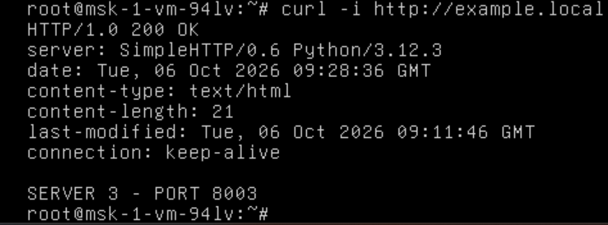
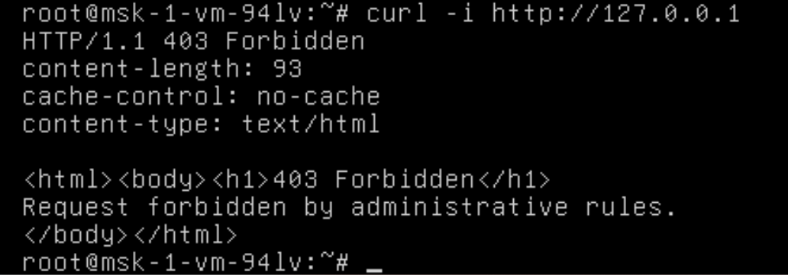

# sflt-02-hw
# Домашнее задание к занятию «Кластеризация и балансировка нагрузки»

**Выполнил:** Захар Полев

## Задание 1

Были запущены два Simple Python HTTP Server:

- `127.0.0.1:8001`
- `127.0.0.1:8002`

HAProxy настроен на прослушивание TCP-порта `8080`.

Балансировка выполняется на 4-м уровне модели OSI в режиме `tcp` с использованием алгоритма Round Robin.

[Конфигурационный файл HAProxy](./haproxy.cfg)

### Работающие серверы



### Конфигурация HAProxy



### Проверка Round Robin

```bash
for i in {1..10}; do curl -s http://127.0.0.1:8080; done
```

Результат:

```text
SERVER 1 - PORT 8001
SERVER 2 - PORT 8002
SERVER 1 - PORT 8001
SERVER 2 - PORT 8002
SERVER 1 - PORT 8001
SERVER 2 - PORT 8002
```



---

## Задание 2

Были запущены три Simple Python HTTP Server:

- `127.0.0.1:8001`
- `127.0.0.1:8002`
- `127.0.0.1:8003`



HAProxy настроен на балансировку HTTP-трафика на 7-м уровне модели OSI.

Используется Weighted Round Robin с весами:

```text
server1 — weight 2
server2 — weight 3
server3 — weight 4
```

Для обработки запросов к `example.local` используется ACL:

```haproxy
acl is_example_local hdr(host) -i example.local
http-request deny unless is_example_local
```

В `/etc/hosts` добавлена запись:

```text
127.0.0.1 example.local
```

### Конфигурация HAProxy





[Конфигурационный файл HAProxy](./haproxy.cfg)

### Проверка Weighted Round Robin

```bash
for i in {1..90}; do curl -s http://example.local; done | sort | uniq -c
```

Результат:

```text
20 SERVER 1 - PORT 8001
30 SERVER 2 - PORT 8002
40 SERVER 3 - PORT 8003
```



### Запрос к example.local

```bash
curl -i http://example.local
```

Результат:

```text
HTTP/1.0 200 OK
```



### Запрос без example.local

```bash
curl -i http://127.0.0.1
```

Результат:

```text
HTTP/1.1 403 Forbidden
```


